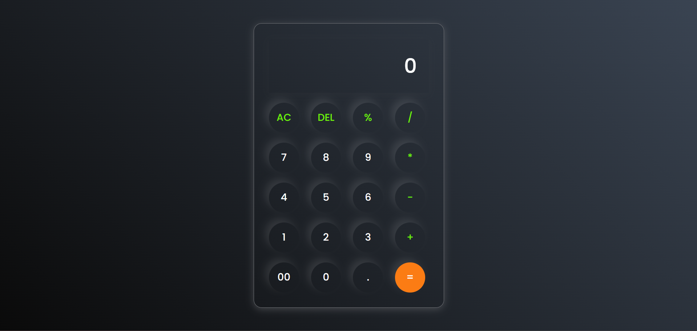

# Simple Calculator 

A stylish and interactive calculator built with HTML, CSS, and JavaScript. This project demonstrates the implementation of a basic calculator with a sleek UI and functional arithmetic operations.

## Project Overview

This project features:
- **Basic Arithmetic Operations**: Addition, subtraction, multiplication, division, and percentage calculation.
- **Clear and Delete Functions**: An `AC` button to clear all input and a `DEL` button to delete the last character.
- **Responsive Design**: Adjusts nicely to different screen sizes.
- **Stylish UI**: Enhanced using modern CSS with a gradient background and glassy buttons.

### Output



### Key Features

- **Neumorphic Design**: Smooth and stylish button and input designs.
- **Lightweight JavaScript**: Implementing all calculations directly in the front end.
- **Responsive Input Field**: Displays the arithmetic operations and results clearly.

## Project Files

- **`index.html`**: Contains the HTML structure of the calculator.
- **`styles.css`**: Contains the styling and layout for the calculator.
- **`script.js`**: Contains the JavaScript code for handling button clicks and performing arithmetic operations.

## How to Use

1. **Clone the Repository**:
   ```bash
   git clone https://github.com/Krithika-N-4/Calculator.git
